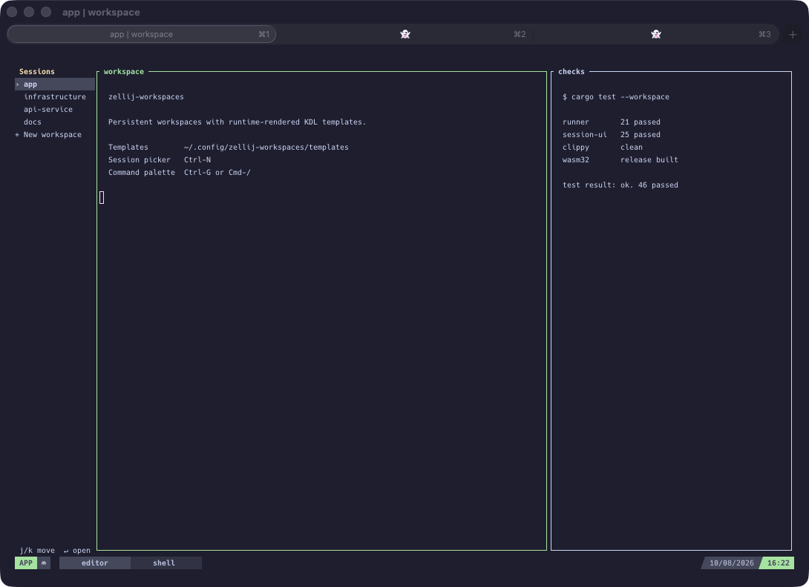
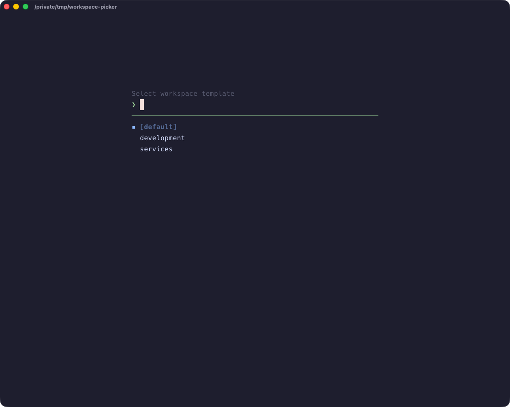

# zellij-workspaces

Persistent Zellij workspaces with a responsive session sidebar, bottom tab
bar, and runtime-rendered workspace templates.

Workspace templates are ordinary Zellij KDL with MiniJinja placeholders. They
are discovered and rendered at runtime, so adding or editing one never
requires rebuilding the runner or plugin.

## Screenshots

The responsive workspace dashboard keeps sessions visible in the left sidebar,
tabs along the bottom, and the rest of the terminal available for real work:



Workspace layouts are discovered from the templates directory at runtime, so
the creation flow immediately offers new or edited templates:



## Releases

Each version tag publishes native `zellij-workspaces` archives for Linux and
macOS on x86_64 and ARM64, plus `session-ui.wasm` and `SHA256SUMS`, on the
[GitHub Releases page](https://github.com/justusschock/zellij-workspaces/releases).
Tags must match the Cargo workspace version, for example `v0.1.0`.

## Build and install

Requirements: stable Rust, Zellij, and the `wasm32-wasip1` Rust target.

```sh
rustup target add wasm32-wasip1
cargo install --path crates/runner
cargo build --release --package zellij-session-ui --target wasm32-wasip1
mkdir -p ~/.config/zellij/plugins \
  ~/.config/zellij-workspaces/templates \
  ~/.config/zellij-workspaces/tab-templates
cp target/wasm32-wasip1/release/session-ui.wasm \
  ~/.config/zellij/plugins/session-ui.wasm
cp examples/development.kdl.tmpl examples/services.kdl.tmpl \
  ~/.config/zellij-workspaces/templates/
cp examples/agent-tab.kdl.tmpl \
  ~/.config/zellij-workspaces/tab-templates/agent.kdl.tmpl
cp examples/keymaps.kdl ~/.config/zellij-workspaces/keymaps.kdl
```

Register the plugin in `~/.config/zellij/config.kdl`:

```kdl
plugins {
    session-ui location="file:~/.config/zellij/plugins/session-ui.wasm"
}
```

Run `zellij-workspaces` to select or create a workspace. Run
`zellij-workspaces --new` to open the creation flow directly.

Configured default workspaces are created or resurrected in the background
before the interactive picker opens. Add them to
`~/.config/zellij-workspaces/workspaces.kdl`:

```kdl
workspaces {
    workspace "project" cwd="~/Developer/project" template="development"
    workspace "services" cwd="~" template="services"
}
```

The order is preserved. Each entry requires a unique session name, an existing
working directory, and the name of a workspace template. A missing config file
means no default workspaces.

Run `zellij-workspaces --new-tab TEMPLATE` inside Zellij to open the workstream
tab flow. Choose an existing Git worktree or create
`<main-worktree>/.worktrees/<workstream>` with a same-named branch from the
current `HEAD`. Existing worktrees also prompt for a tab name.

Tab templates live in `~/.config/zellij-workspaces/tab-templates` and receive:

- `tab.name`: the requested tab name
- `worktree.cwd`: the selected or newly created worktree directory
- `tools.shell`, `tools.editor`, and explicitly prefixed `vars`, as workspace
  templates do

The tab template owns the panes and commands. For example:

```kdl
layout {
    tab name="{{ tab.name | kdl }}" focus=true {
        pane cwd="{{ worktree.cwd | kdl }}" command="agent"
    }
}
```

## Template contract

Templates live in `~/.config/zellij-workspaces/templates` by default and end
in `.kdl.tmpl`. The following values are available:

- `workspace.name`: the requested Zellij session name
- `workspace.cwd`: the selected absolute working directory
- `tools.shell`: `$SHELL`, falling back to `/bin/sh`
- `tools.editor`: `$VISUAL`, then `$EDITOR`, falling back to `vi`
- `vars`: environment variables explicitly prefixed with
  `ZELLIJ_WORKSPACES_VAR_`

Use the `kdl` filter whenever a value is placed inside a quoted KDL string:

```kdl
pane cwd="{{ workspace.cwd | kdl }}"
```

For example, `ZELLIJ_WORKSPACES_VAR_AGENT=codex` is available as
`vars.AGENT`. Unprefixed environment variables are not exposed to templates.

Rendered layouts are written atomically to the platform cache directory and
passed to Zellij by absolute path. Templates themselves are never modified.
Different rendered contents get different cache files, so concurrent workspace
creation cannot overwrite another workspace's layout.

Templates and their rendered layouts are configuration files, not a secret
store. Do not interpolate credentials. Resolve secrets inside the launched
process through your normal secret manager instead.

Render a template without starting Zellij:

```sh
zellij-workspaces --render development demo "$PWD"
```

The command prints the generated layout path, which is useful for inspection
and validation.

Render a tab template the same way:

```sh
zellij-workspaces --render-tab agent topic "$PWD"
```

## Keymaps

Picker and sidebar bindings live in
`~/.config/zellij-workspaces/keymaps.kdl`. Each named action accepts one or
more keys using Zellij's key spelling, such as `"j"`, `"Up"`, `"Enter"`, or
`"Ctrl n"`. Copy `examples/keymaps.kdl` for the complete default file.

The native picker reads this file directly. The sandboxed sidebar asks the
installed `zellij-workspaces` runner for the normalized `sidebar` section, so
both interfaces use one source without giving the WASM plugin filesystem
access. Missing files use built-in defaults. Invalid files stop the native
runner with a configuration error; an already-running sidebar keeps its safe
defaults if reloading fails.

These mappings apply only while the picker or sidebar has focus. Global Zellij
bindings that open or focus the sidebar remain in `~/.config/zellij/config.kdl`
because Zellij must intercept them before the plugin receives input.

## Examples

`examples/development.kdl.tmpl` demonstrates editor, agent, and shell tabs.
`examples/services.kdl.tmpl` demonstrates generic service and log panes. They
contain no project-specific services, hosts, ports, or vendor assumptions.

## Configuration

The runner supports these environment variables:

- `ZELLIJ_WORKSPACES_ROOT_DIR`
- `ZELLIJ_WORKSPACES_IGNORE_DIRS`
- `ZELLIJ_WORKSPACES_MAX_DIRS_DEPTH`
- `ZELLIJ_WORKSPACES_TEMPLATES_DIR`
- `ZELLIJ_WORKSPACES_TAB_TEMPLATES_DIR`
- `ZELLIJ_WORKSPACES_CONFIG_FILE`
- `ZELLIJ_WORKSPACES_KEYMAPS_FILE`
- `ZELLIJ_WORKSPACES_CACHE_DIR`
- `ZELLIJ_WORKSPACES_BANNERS_DIR`

Relative paths are resolved from the home directory.

The directory picker also accepts any existing directory entered directly.
Use `~` or `~/path` for a home-relative path, an absolute path, or a path
relative to the shell that launched the picker. Directly entered paths do not
need to be under `ZELLIJ_WORKSPACES_ROOT_DIR` or present in the discovered list.

## Attribution

This project builds on Alex Fedoseev's Zellij runner and statusbar work. See
[NOTICE.md](NOTICE.md) and the [upstream permission](https://github.com/alex35mil/dotfiles/issues/11#issuecomment-5233032745).

## License

MIT
